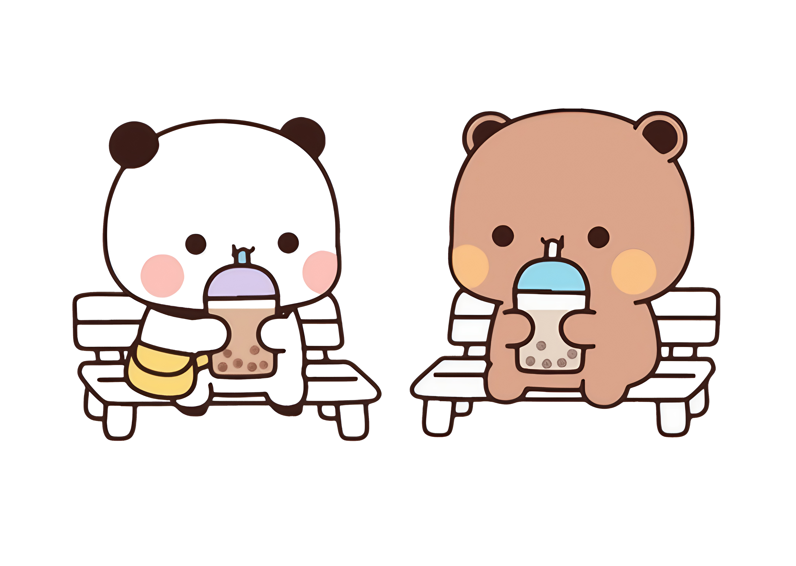
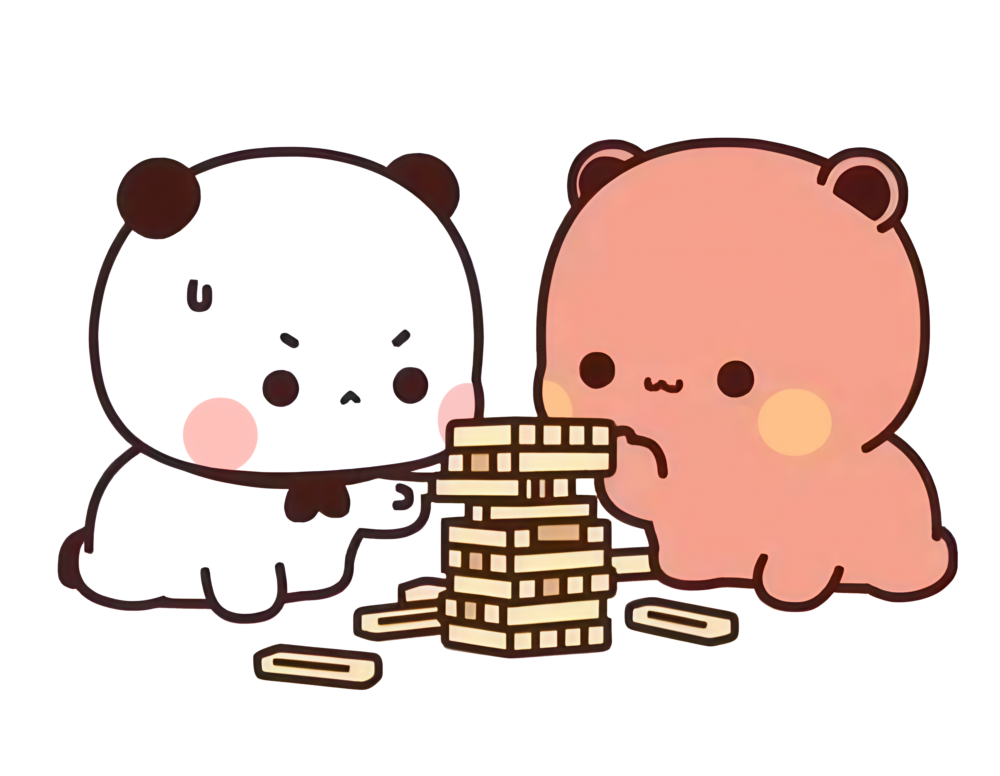
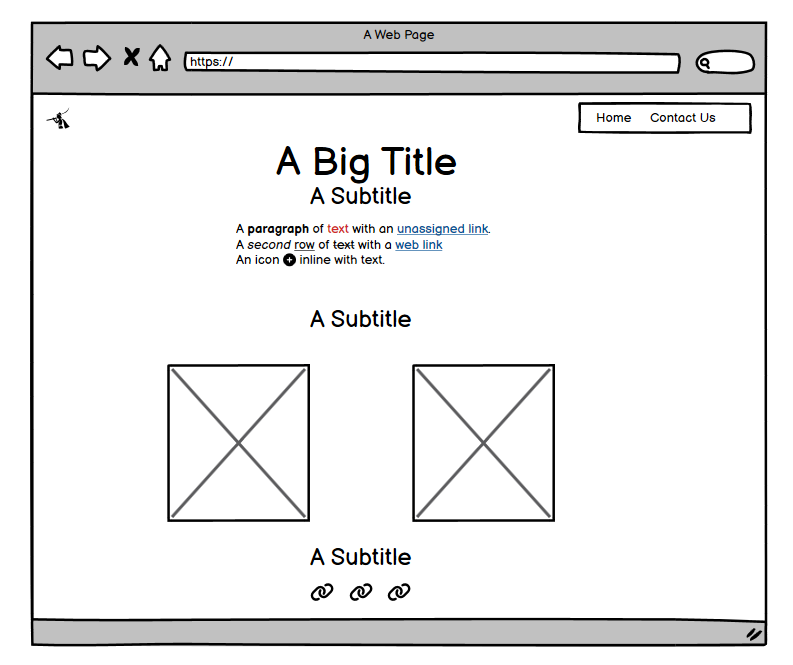
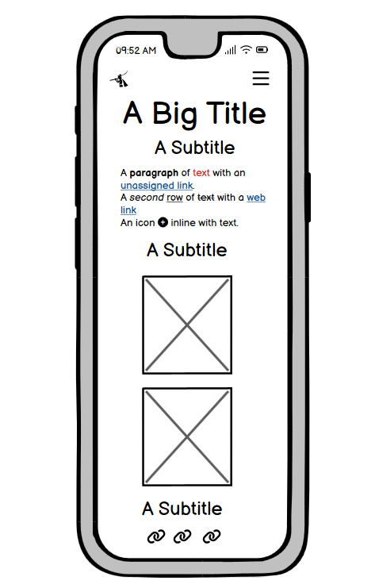
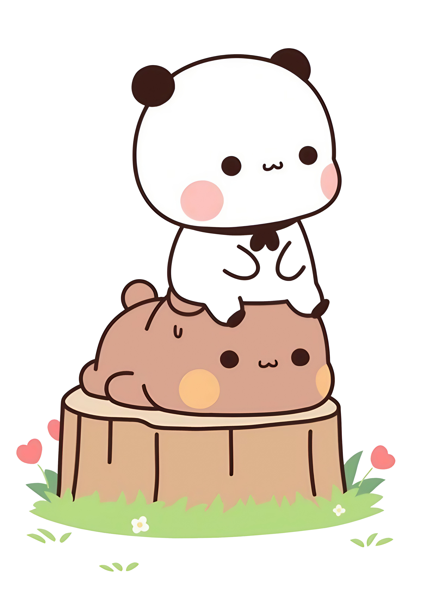
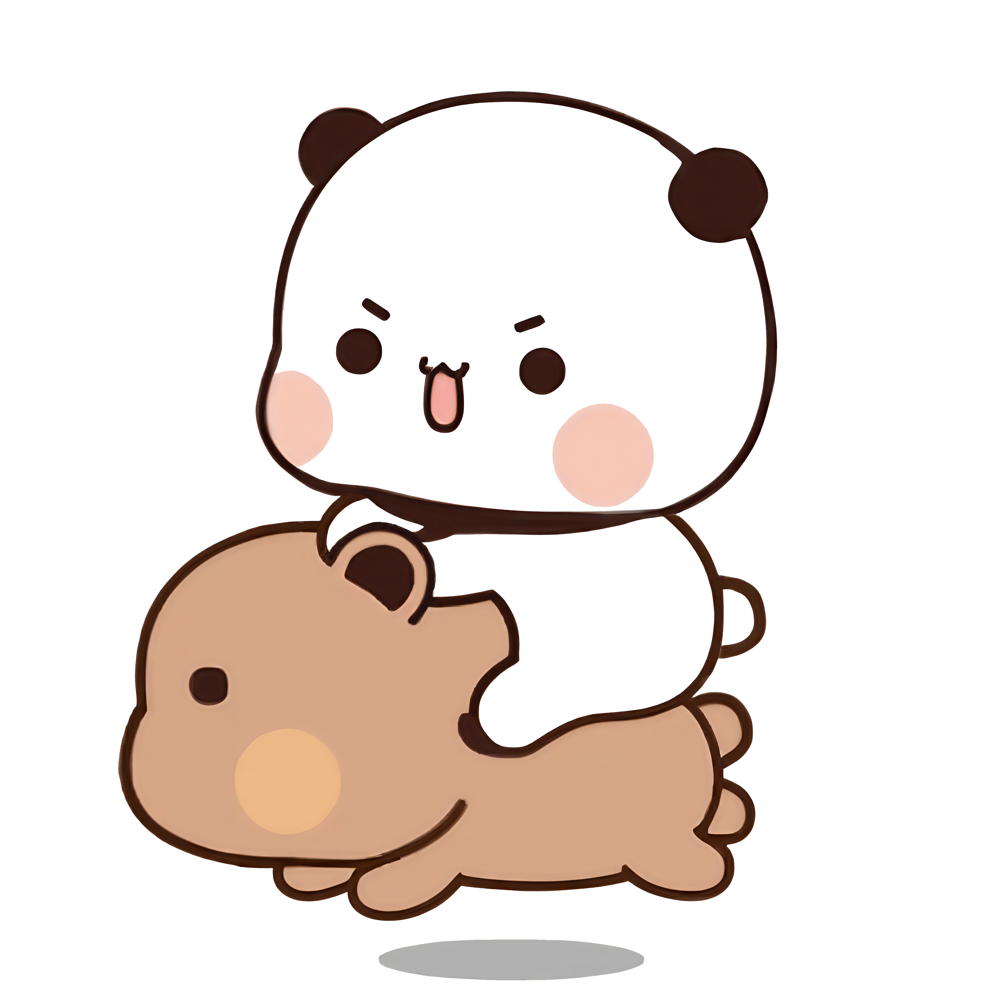

# Dudu & Bubu Diverge

  <a href="https://xgodai.github.io/Dudu-Bubu-Diverge/index.html" target="_blank">
    Live Preview.
  </a>

## Introduction

**Dudu & Bubu Diverge** is an inclusive, narrative-driven website chronicling the vibrant adventures of a neurodivergent couple. This project aims to provide an engaging, accessible experience that emphasizes empathy, exploration, and awareness through creative storytelling and design.

## Table of Contents

- [Project Outline](#project-outline)
  - [Key Objectives](#key-objectives)
- [UX Design](#ux-design)
  - [User Stories](#user-stories)
  - [Colors](#colors)
  - [Main Palette](#main-palette)
  - [Fonts](#fonts)
  - [WireFrames](#wireframes)
  - [Imagery](#imagery)
- [Features](#features)
  - [General Features](#general-features)
  - [Navigation](#navigation)
  - [Bootstrap Cards](#bootstrap-cards)
- [Built With](#built-with)
  - [Technologies and Languages](#technologies-and-languages)
  - [Libraries and Frameworks](#libraries-and-frameworks)
  - [Tools and Programs](#tools-and-programs)
- [Testing](#testing)
- [Credits](#credits)

## Project Outline

### Key Objectives

- Create an accessible and visually appealing website
- Celebrate neurodivergence and inclusivity
- Tell unique stories through interactive web design
- Encourage exploration and engagement through UX elements

## UX Design

### User Stories

- As a user, I want to easily navigate between different stories and experiences.
- As a neurodivergent individual, I want a website that feels welcoming, calming, and accessible.
- As a new visitor, I want to understand the purpose of the site within a few seconds of landing on it.

### Colors

The color scheme is thoughtfully selected to accommodate a broad range of sensory preferences and visual sensitivities.

### Main Palette

- Background Color: #bfecff - Light Blue
- Dudu Card Color: #96d8b5 - Light Green
- Bubu Card Color: #f1f0ff - Light Pink
- Contact Us Card: #ffb74d - Orange
- Success Card: #e6308a - Pink

### Fonts

- Headings: *Pacifico*, cursive
- Body Text: *Poetsen One*, sans-serif

### Imagery

Original art and imagery are used throughout the site to express the world of Dudu & Bubu in a whimsical and heartfelt way by [Huang Xiao B (黄小B)]

### WireFrames

Wireframes were designed for both desktop and mobile responsiveness, ensuring optimal usability across devices.

## Features

### General Features

- Responsive layout
- Engaging narrative structure
- Subtle transitions for accessibility

### Navigation

- Fixed top navigation bar with clear links
- Smooth scrolling between sections

### Bootstrap Cards

- Custom-styled Bootstrap cards to showcase characters, stories, and destinations
- Includes hover effects and modals for extended interaction

## Built With

### Technologies and Languages

### Libraries and Frameworks

### Tools and Programs

 

## Testing

- HTML Testing has been done across all HTML Docs.

- [HTML Validation](https://validator.w3.org)
  
- [CSS Validation Index Page](https://jigsaw.w3.org/css-validator/)
  
- [Light House Testing](https://developer.chrome.com/docs/lighthouse/overview)
  
## Credits

- Website designed and developed by [xGodai]
- Illustrations by [Huang Xiao B (黄小B)]
- Fonts provided by [Google Fonts](https://fonts.google.com/)
- Bootstrap framework from [getbootstrap.com](https://getbootstrap.com/)
- Special Thanks, Wendy NG.

---

